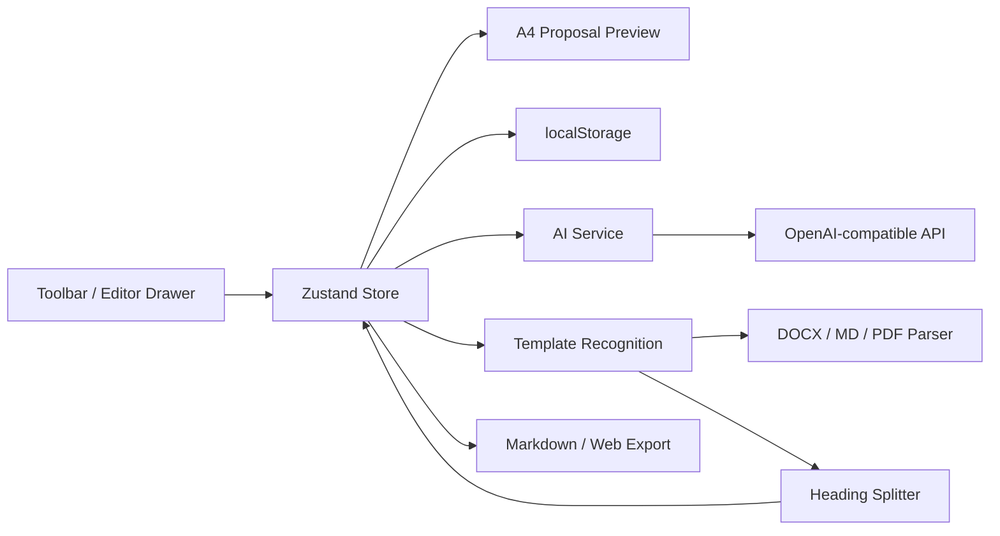

# 议案生成器 Demo

企业内部议案 / 请示写作工作台原型。产品形态参考优派简历：以 A4 公文预览为中心，模板、AI 起草、内容编辑、格式检查、导出和模板工坊都通过右侧悬浮工具栏打开侧边栏完成。

当前 Demo 面向“安居建业内部议案 / 请示”场景，重点解决：选择或创建模板、用大白话起草、按公文板块编辑、局部 AI 润色、A4 预览、格式检查和 Markdown / 网页试用导出。

## 快速上手

### 直接试用网页包

如果已经拿到 `proposal-demo-web.zip`：

1. 解压压缩包。
2. 双击打开 `proposal-demo-web/index.html`。
3. 所有数据保存在当前浏览器本地，不需要服务器。
4. 未配置 API Key 时，AI 起草会使用模拟结果；局部 AI 修改需要配置 API Key。

### 本地开发运行

```bash
npm install
npm run dev
```

打开 `http://127.0.0.1:5173/`。

### 构建与导出

```bash
npm run build
npm run export:web
```

- `dist/`：标准 Vite 构建结果。
- `proposal-demo-web/`：可发给别人双击打开的单文件网页。
- `proposal-demo-web.zip`：压缩后的试用包，需要手动压缩或沿用当前仓库已有导出流程。

## 主要功能

### 1. A4 公文预览

- 页面中心是实时 A4 公文预览。
- 标题、主送对象、正文板块、附件、落款、日期会同步展示。
- 行距支持在 26-28 磅之间调整。
- 公文样式参考公司议案 / 请示格式标准：标题、一级标题、正文缩进、编号层级等。

### 2. 模板库

内置模板：

- 年度计划外项目采购立项请示。
- 参控股公司上报总办会（党委会）议案。

模板库能力：

- 选择模板并生成初始议案。
- 调整模板字段：名称、简称、文档类型、会议场景、主送对象、标题样式、缘由段、附件、落款。
- 调整模板板块：新增、删除、拖拽排序、修改标题、提示词和默认内容。
- 内置模板支持本地覆盖保存，不修改源码。
- 内置模板支持恢复系统默认版本。
- 自定义模板保存到浏览器本地。

### 3. AI 起草

- 用户在“AI 起草”中用大白话说明事项。
- 系统按当前模板生成结构化草稿。
- 未配置 BYOK 时，使用本地模拟生成，保证流程可体验。
- 配置 BYOK 后，调用用户自己的 OpenAI-compatible API。

### 4. 内容编辑

- 内容按议案 / 模板的大标题动态拆成多个板块。
- 支持识别 `一、`、`二、`、`三、`、`第X部分`、Markdown 标题等一级标题。
- 可手动点击“按大标题重新拆分”，把长文本重新拆成板块。
- 每个板块支持富文本编辑、加粗、斜体、有序 / 无序列表和拖拽排序。

### 5. 局部 AI 修改

- 每个正文板块的富文本工具栏都有 AI 按钮。
- 先选中要修改的文字，再点击 AI。
- 输入修改要求，例如“更正式”“压缩成两句话”“补充必要性语气”。
- AI 返回结果先进入预览，用户点击“替换选区”后才写回正文。
- 未配置 BYOK 时会提示去“密钥”配置 API Key，不做模拟改写。

### 6. 模板工坊

- 手动填写模板名称、适用场景、常见事项和大致板块，保存为自定义模板。
- 支持上传 `DOCX / MD / PDF` 自动识别模板框架。
- DOCX 使用浏览器端 Word 文本提取。
- Markdown / TXT 直接读取文本。
- PDF 支持可复制文字的 PDF，不做扫描件 OCR。
- 上传后先本地识别标题、主送对象、缘由段、一级标题板块、附件和落款。
- 如果已配置 BYOK，会在本地识别基础上尝试 AI 增强提示词和模板结构。
- 上传识别结果不会自动保存，必须用户确认后点击保存。

### 7. BYOK 密钥配置

BYOK 即 Bring Your Own Key，用户使用自己的模型 API Key。

内置常用 OpenAI-compatible 预设：

- DeepSeek 官方。
- OpenAI。
- 通义千问 DashScope。
- Kimi / Moonshot。
- 硅基流动。
- OpenRouter。
- 自定义 OpenAI-compatible 接口。

用户选择接口和模型后，只需要填写 API Key。配置保存在浏览器本地，不上传服务器。

### 8. 格式检查

当前检查项包括：

- 标题已填写且末尾无标点。
- 主送对象已填写。
- 正文引言已填写。
- 固定板块均有内容。
- 包含明确提请审议事项。
- 落款和日期已填写。
- 行距位于 26-28 磅。

### 9. 导出

- Markdown 真实导出可用。
- DOCX / PDF 导出入口已预留，后续可接正式 Word 排版或浏览器打印生成。
- `npm run export:web` 可生成可分发的单文件网页。

## 使用流程

### 从模板起草一份议案

1. 点击右侧“模板”，选择合适模板。
2. 点击“AI”，用大白话说明事项背景、金额、程序状态和希望审议的事项。
3. 点击“生成结构化草稿”。
4. 点击“编辑”，逐个板块修改正文。
5. 需要局部润色时，选中文字并点击该板块工具栏里的 AI 按钮。
6. 点击“检查”，查看格式问题。
7. 点击“导出”，导出 Markdown。

### 创建一个自定义模板

1. 点击“工坊”。
2. 手动输入模板信息，或上传 DOCX / MD / PDF。
3. 系统识别出板块后，检查并调整模板字段。
4. 点击“保存为模板”。
5. 新模板会出现在模板库中。

### 调整已有模板

1. 点击“模板”。
2. 在模板卡片上点击“调整”。
3. 修改模板字段或板块。
4. 点击“保存模板”。
5. 内置模板会显示“内置已调整”；需要回退时点击“恢复系统默认模板”。

## 软件结构

```text
src/
├── components/
│   ├── Proposal/          # A4 议案渲染核心
│   │   ├── templates/     # 内置模板、模板转文档逻辑、编号工具
│   │   └── modules/       # 正文章节渲染模块
│   ├── Editor/            # 侧边栏抽屉、模板编辑、内容编辑、工坊、导出
│   ├── Toolbar/           # 右侧悬浮工具栏
│   └── ui/                # shadcn/ui 风格基础组件
├── config/
│   └── ai-providers.ts    # API 接口和模型预设
├── hooks/
│   └── useFormatChecks.ts # 格式检查 Hook
├── i18n/                  # 中英文界面文案
├── services/
│   ├── ai.ts              # AI 起草、局部改写、接口 URL 适配
│   ├── proposal.ts        # 本地存储、导出、基础检查工具
│   └── templateRecognition.ts # DOCX / MD / PDF 模板识别
├── store/
│   └── proposal.ts        # Zustand 全局状态
├── types/
│   └── proposal.ts        # 模板、文档、AI 配置等类型
└── utils/
    ├── content.ts         # HTML / 文本 / Markdown 转换
    └── documentSplit.ts   # 按一级标题拆分正文板块
```

## 代码架构



### 状态管理

核心状态集中在 `src/store/proposal.ts`：

- `document`：当前正在编辑的议案。
- `templates`：内置模板叠加本地覆盖后，再合并自定义模板。
- `customTemplates`：用户保存的自定义模板。
- `templateOverrides`：用户对内置模板的本地覆盖。
- `aiConfig`：BYOK 配置。
- `plainText`：AI 起草输入。
- `templateDraft`：模板库 / 工坊编辑中的模板草稿。

所有持久化都走浏览器 `localStorage`，不需要服务端。

### 模板与文档

- 模板定义 `ProposalTemplate`：描述标题样式、主送、缘由段、板块、附件、落款等。
- 文档定义 `ProposalDocument`：当前 A4 预览和编辑器使用的实际内容。
- `createDocumentFromTemplate` 把模板转换为当前文档。
- `documentSplit.ts` 负责按一级标题拆分长文本，保证长议案可以动态形成不定数量板块。

### AI 调用

`src/services/ai.ts` 负责：

- 拼接不同供应商的 chat completions URL。
- AI 起草完整文档。
- 局部改写选中的文字。
- API 调用失败时保留当前内容，不破坏用户编辑。

### 模板识别

`src/services/templateRecognition.ts` 负责：

- 提取上传文件文本。
- 本地识别模板字段和一级标题板块。
- 可选调用 BYOK 做 AI 增强。
- 输出模板草稿，等待用户确认保存。

## 数据与隐私

- 当前版本没有后端服务。
- 文档、模板、API 配置都保存在浏览器本地。
- API Key 不会上传到项目服务器。
- 使用 BYOK 时，请求会从浏览器直接发到用户选择的模型服务商。
- 上传识别文件在浏览器本地解析；仅当已配置 BYOK 并触发 AI 增强时，识别文本会发送给模型服务商。

## 常见问题

### 双击 index.html 是空白怎么办？

请使用 `npm run export:web` 重新生成 `proposal-demo-web/index.html`。当前导出脚本会把样式和脚本内联，并用 `type="module"` 保证浏览器可执行。

### PDF 上传为什么识别失败？

首版只支持可复制文字的 PDF，不支持扫描件 OCR。扫描版 PDF 需要后续接 OCR 能力。

### 为什么局部 AI 修改不能模拟？

完整 AI 起草支持模拟，是为了保证主流程可体验。局部改写会直接改用户选中的正文，为避免误导，当前要求必须配置真实 BYOK。

### DOCX / PDF 现在能导出吗？

当前 DOCX / PDF 是预留入口。真实可用导出是 Markdown 和单文件网页包。后续可以接 Word 排版生成或浏览器打印 PDF。

## 后续扩展方向

- 正式 DOCX 导出，复用公文格式 token。
- PDF 打印 / 服务端渲染。
- 扫描件 OCR 模板识别。
- 模板版本管理和团队共享。
- 审批流、账号体系、多人协作。
